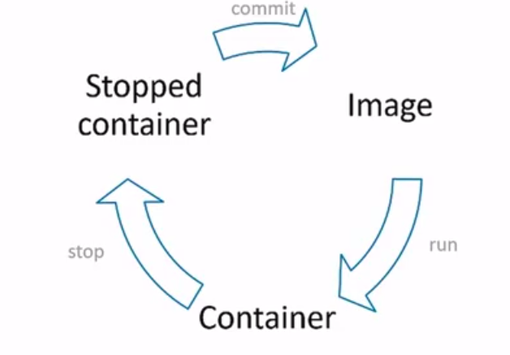
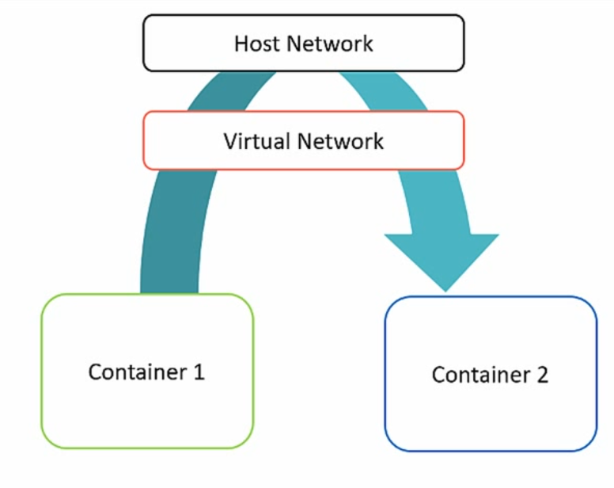
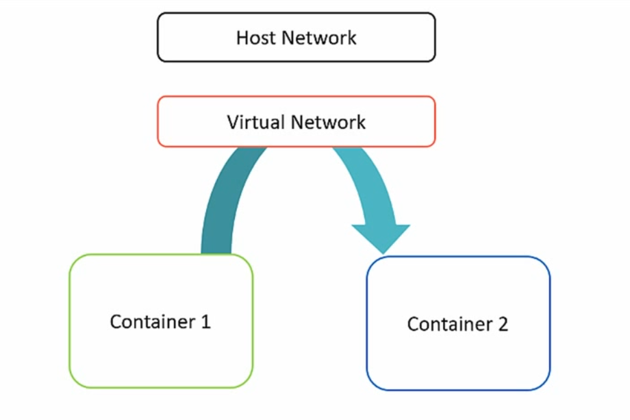

## Docker có 3 thành phần chính
* Docker client
* Docker Host
* Docker Registry (Docker Hub)
## Docker image
* Liệt kê các image  
` docker images `  
*Tải một image về  
`docker pull <image>`
* Cấu trúc tên:
`registry.repo.com:port/organization/image-name:version-tag`
* Xóa image
` docker rmi <id hoặc name iamge>`  
* Xóa tất cả image
`docker rmi $(docker image -q)`
* backup image `docker save -o <namefile.tar.gz> <danh sách các image cần backup>`
* phục hồi image `docker load -i <file backup.tar.gz> <image>`

## Chạy một contaniner
*Chạy một contaniner từ images*  
` docker run <image:tag> `  
*Chạy nền một container (Detach)*  
`docker run -d <image:tage>`  
*Kiểm tra các container đang chạy*  
` docker ps`  
*Attach một container đang chạy nền*  
`docker attach <container id>`  
*Để Detach trở lại ấn tổ hợp phím  Ctrl+Q*  
*Liệt kê tất cả các container đang chạy và đã dừng*  
`docker ps -a`  
*Liệt kê container vừa dừng*  
`docker ps -l`  

## Vòng đời của docker
  
*  `docker run`  nhận đầu vào là image và nhận đầu ra là container
* `docker commit` nhận đầu vào là một container và đầu ra là một image  
*Tạo một images từ một container đã dừng*  
`docker commit <container id> <name>:<tag>`  
*Liệt kê các images*  
`docker images`  
*Gắn tag cho image*  
`docker tag <image id> <name>:<tag>`
## Cơ chế lưu trữ của docker
* Cơ chế lưu trữ copy-on-write
* Tạo một hệ thống mới ngay lập tức mà không cần copy tất cả file hệ thống
* Hệ thống lưu trữ lưu lại mỗi thay đổi
## Chạy các tiến trình trong container
* Container có tiến trình chính
* Container dừng khi tiến trình chính kết thúc
* Container có thể được đặt tên `docker run --name <name container> <image>`  
## Docker exec
* Khởi tạo một process khác bên trong container đã có
* Tiện lợi cho việc debug 
* Không thể thêm port, volume,...  
` docker exec -it <container id> <process>`
## Docker create
*dùng để tạo container với các config tương tự như docker run, container không chạy ngay từ đầu mà phải dùng lệnh `docker start`*  
`docker create <image>`
## Docker start/stop/restart
`docker stop <container id>` dùng stop một container  
`docker restart <container id>` dùng khởi chạy lại container đã dừng
## Docker cp
* dùng để copy dữ liệu từ container tới local machine và ngược lại
* dùng được cho cả container stop và running
`docker cp <file local> <dockername>:<đường dẫn file hoặc folder> ` 
## Docker inspect
* Kiểm tra các thiết lập của Docker (network, driver)
* Các thông tin được trả về dưới dạng json
`docker inspect <container id>`  
## Docker rm
* Dùng để xóa các container dựa theo tên hoặc id
`docker rm <container id>`
* Xóa toàn bộ các container đã stop
`docker rm $(docker ps -a -q)` 
 ## Docker logs
 * Xem output của container
 `docker logs <container id hoặc name>`
 * Không nên để cho dung lượng phình quá to
 ## Dừng và xóa container
 * khi không dùng tới container ta nên dừng và xóa nó đi  
 `docker kill <container>` dừng container   
 `docker rm <container>` xóa bỏ container  
 ## Giới hạn tài nguyên 
 * Giới hạn memory
 `docker run --memory <total-memory-limit> <image> <command>`  
 *ví dụ*  
 `docker run --memory 512M ubuntu bash`  
 * Giới hạn CPU  
 ** Tương đối  
 `docker run --cpu-shares=<limit> <image> <command>`  
 *ví dụ:* `docker run --cpu-shares=20 ubuntu bash`  
 ** Thời lượng và hạn mức  
 `docker run --cpu-period=<period-limit> --cpu-quota=<quota-limit> <image> <command>`  
 *ví dụ:* `docker run --cpu-period=40000 --cpu-quota=20000 ubuntu bash`  
 => nếu 1 cpu, thì container chiếm 50% cứ mỗi 40ms
 ## Một số lưu ý:
 * Hạn chế việc để container lấy dependency khi khởi động container
 * Tránh để các file quan trọng trong container không tên
# Network trong Container
* các chương trình trong container được mặc định tách biệt hoàn toàn với internet
* Nhóm các  container lại thành một mạng nội bộ
* Kiểm soát sự liên kết giữa container này với container kia
* Sử dụng phương thức expose cổng và link container
* Docker có cơ chế đặc biệt giúp các container tìm và liên kết nhau
* Xác định cổng bên trong và bên ngoài container
* Không giới hạn cổng được mở  
`docker run -p <host port>:<container port> <image>`  
* Nếu không chỉ định cổng bên ngoài thì port bên ngoài sẽ được mở ngẫu nhiên, port bên trong là cố định. Để kiểm tra các port đã mở trên container: `docker port <container id hoặc name>`
* Cho phép nhiều container chạy các chương trình với cổng cố định
* Mặc định docker mở TCP, nếu muốn mở udp thì làm như sau: `docker run -p outside-port:inside-port/protocol`  
*ví dụ:* `docker run -p 111:222/udp`  

## Liên kết các container thông qua host

## Liên kết trực tiếp các container

* Dùng để kiểm tra xem container đang chạy gì và ở chỗ nào
* Kết nối tất cả các cổng, nhưng 1 chiều
* Chỉ dành cho các dịch vụ mà không thể chạy trên nhiều host khác nhau  
`docker run --link <name container caanf link> --name <name> <image>`  
* Tự động gán hostname
* Liên kết có thể bị đứt nếu container khởi động lại
## Liên kết động giữa các container
* Docker cung cấp tính năng tạo mạng riêng nội bộ
* Name Server với cơ chế quản lý địa chỉ IP và name
* Cần tạo lập mạng trước rồi chạy các container liên quan
` docker network create [OPTIONS] [name network]`  
*Khởi chạy container trong network*  
`docker run --net=<network name> --name <name> <image>`  

## Địa chỉ IP sử dụng trong các service
* Service lắng nghe từ local machine mặc định chỉ được truy cập từ bên trong container
* Để cho phép truy cập từ ngoài cần bind address thành 0.0.0.0
* Nên dùng Docker để giới hạn truy cập, chỉ cho phép truy cập từ host
* ví dụ: `docker run -p 127.0.0.1:111:111/tcp` chỉ cho phép host có địa chỉ ip 127.0.0.1 truy cập vào port 111 của container  

# Docker Registry
* Docker registry quản lý và phân phối image
* Có thể setup một registry cho cá nhân hoặc doanh nghiệp
* Có thể tìm kiếm image qua cli `docker search <keywork>` hoặc tìm trên https://hub.docker.com
* login vào docker hub: `docker login` nhập vào username và password
* upload image lên docker hub: `docker push <image>:<tag> `
# Volume
* Đĩa ảo để chứa và chia sẻ dữ liệu
* Có 2 loại chính là Volume giữa host và cointainer: Khi tao dữ liệu thì nó sẽ nằm trên host khi container bị xóa thì vẫn có thể truy cập được vào dữ liệu, Volume giữa các container khi không có container nào sử dụng nữa thì nó sẽ tự động bị loại bỏ

* Volume dữ liệu local trên host không phải là một thành phần của image
* map thư mục vào container: `docker run -v <thư mục trên host>:<thư mục trong container>`
* Có thể chia sẻ thư mục hoặc file đơn lẻ với host, File cần được tạo trước khi chạy container nếu không folder cha sẽ được chia sẻ
## Chia sẻ dữ liệu giữa các container
*ví dụ:* chạy một container và tạo ra một volume share `docker run -it --name pc1 -v /share ubuntu bash`  
chạy tiếp một container thứ 2 và share chung volume với container 1: ` docker run -it --name pc2 --volumes-from pc1 ubuntu bash`  
# Dockerfile
* File định nghĩa tất cả những thứ cần tạo ra trong image
* lệnh build docker image từ docker file `docker build -t <name>:<tag> <đường dẫn tới Dockerfile>
* Khi build xong, image sẽ nàm ở local registry trên máy
* Một số lện trong dockerfile
- FROM <image>:<tag> : nguồn image, là lệnh đầu tiên trong Dockefile *ví dụ:* FROM ubuntu:16.04  
- MAINTAINER <tên>: chỉ là dạng ghi chú và thông tin tác giả  
- RUN <command>: chạy lệnh đợi lệnh chạy xong và lưu kết quả  
- ADD: thêm local file ADD data.txt/data.txt, thêm nội dung file tar ADD source-code.tar.gz /src/ tự động giải nén vào thư mục /src/. Download dữ liệu tử url ADD https://url /data/  
- ENV: khai báo các biến môi trường sau khi image được build các biến này vẫn tồn tại: *ví dụ:* `ENV LOG_FOLDER=/app_dirs/logs/`  
- ENTRYPOINT khai báo sự bắt đầu cho lệnh được chạy khi bạn không chắc thì nên chạy CMD  
 - CMD khai báo toàn bộ lệnh được chạy  

